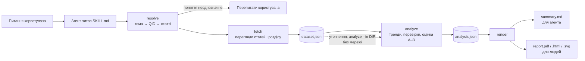

# wiki-trends

Навичка ([Agent Skill](https://agentskills.io/specification)) для AI-агента. Вона допомагає засновнику чи продакту B2C-продукту вирішити, куди інвестувати далі: яку тему додати, якою мовою локалізуватися, чи є в ідеї аудиторія, яку варто перевіряти. Дані беруться з переглядів Вікіпедії. Агент отримує стислий висновок з оцінкою надійності, а людина отримує звіт на одну сторінку (PDF), який можна переслати далі.

Навичка складається з двох частин:

- **`SKILL.md`** — інструкція для агента: коли навичку вмикати, у якому порядку діяти, що можна стверджувати, а що ні.
- **`wikitrends`** — Go-програма без жодних сторонніх залежностей. Вона робить усю роботу з даними: знаходить одне й те саме поняття в різних мовах через Wikidata, завантажує перегляди з кешем, нормує їх на трафік мовного розділу, рахує тренд кількома незалежними методами і ставить оцінку надійності A–D з переліком причин.

Агент нічого не рахує сам. Він уточнює питання, обирає порівняння і пояснює результат. Так зроблено навмисно, і нижче пояснено чому.

> **Головна проблема цих даних.** Уся Вікіпедія втрачає людський трафік: пошуковики й AI-асистенти відповідають, не відправляючи людину на сайт. Тому в абсолютних числах падає майже будь-яка тема. Приклад з цього репозиторію: стаття «Астрономія» в українській Вікіпедії втратила **−51 %/рік** переглядів, але весь український розділ за той самий час втратив **−21 %/рік**. У частці від трафіку розділу падіння становить **−39 %/рік**. Приблизно половина «обвалу» стосується платформи, а не теми. Більшість рішень у цьому проєкті виросли з того, що наївний графік переглядів дає впевнену, але хибну відповідь.


---

## Зміст

1. [Яку задачу розв'язує навичка](#1-яку-задачу-розвязує-навичка)
2. [Швидкий старт](#2-швидкий-старт)
3. [Архітектура в цілому](#3-архітектура-в-цілому)
4. [Шлях одного запиту крок за кроком](#4-шлях-одного-запиту-крок-за-кроком)
5. [Мережевий шар і кеш](#5-мережевий-шар-і-кеш)
6. [Архітектурні рішення і чому саме так](#6-архітектурні-рішення-і-чому-саме-так)
7. [Як перевірялась коректність](#7-як-перевірялась-коректність)
8. [Перевірка на Claude Haiku 4.5](#8-перевірка-на-claude-haiku-45)
9. [Обмеження](#9-обмеження)
10. [Структура репозиторію і карта коду](#10-структура-репозиторію-і-карта-коду)
11. [Словник](#11-словник)

---

## 1. Яку задачу розв'язує навичка

Команді B2C-продукту постійно доводиться обирати: додати курс з астрономії чи з фінансової грамотності, локалізуватися польською чи в'єтнамською. Потрібен дешевий перший сигнал: чи цікавить тема аудиторію конкретною мовою, як змінюється цей інтерес і наскільки цьому числу можна вірити.

Вікіпедія добре підходить для такого сигналу: відкриті абсолютні числа (Google Trends дає лише відносний індекс 0–100), щоденні дані з 2015 року, окремо для кожного мовного розділу, безкоштовно і без ключів доступу. Але вона міряє **цікавість, а не намір купити**. Тому навичка завжди відповідає у формі «що перевірити далі», а не «що будувати».

| Питання | Чи може відповісти | Чим |
|---|---|---|
| Чи змінюється цікавість до теми X? | так | тренд частки + порівняння рік до року |
| Яка з цих мовних аудиторій найбільше цікавиться X? | так | частка на мільйон переглядів, порівняно між розділами |
| Коли протягом року цікавість найвища? | так, якщо є 2–3 роки даних | річний сезонний індекс + перевірка повторюваності |
| Чи заплатять люди за X? | **ні** | тут цього немає |
| Який розмір ринку X? | **ні** | перегляди не дорівнюють користувачам |

Навичка розрахована на три типи запитів із завдання:

- «Порівняй зростання інтересу до інтервального голодування в польській і чеській Вікіпедії за два роки».
- «Чи зростає інтерес до астрономії в українській Вікіпедії, і наскільки цьому можна довіряти?»
- «Порівняй інтерес до вивчення англійської в обраних розділах і скажи, які аудиторії досліджувати далі».

А також на уточнення після першої відповіді: «а в абсолютних числах?», «прибери сплеск», «мені важливіший розмір аудиторії», «зроби три роки», «додай німецьку».

---

## 2. Швидкий старт

**Потрібно:** Go 1.21 або новіший. Більше нічого: жодних залежностей, кроку збирання чи скомпільованих файлів у репозиторії.

### Підключити як навичку

Специфікація Agent Skills вимагає, щоб поле `name` у `SKILL.md` збігалося з назвою теки навички, тому тека чи симлінк у будь-якому варіанті нижче має називатися `wiki-trends`.

**Для всіх проєктів на машині.** Склонувати репозиторій і зробити симлінк у `~/.claude/skills`. Навичку буде видно в кожному проєкті, відкритому в Claude Code:

```bash
git clone <url-репозиторію> wiki-trends
cd wiki-trends
mkdir -p ~/.claude/skills
ln -s "$PWD" ~/.claude/skills/wiki-trends
```

**Лише для одного проєкту.** Покласти навичку в `.claude/skills/` усередині цього проєкту. Для себе вистачить симлінка на вже склонований репозиторій:

```bash
# з кореня проєкту
mkdir -p .claude/skills
ln -s /шлях/до/wiki-trends .claude/skills/wiki-trends
```

Симлінк працює лише на тій машині, де його створили. Щоб навичка була в усіх, хто клонує проєкт, її підключають як git submodule:

```bash
# з кореня проєкту
git submodule add <url-репозиторію> .claude/skills/wiki-trends
```

Після цього агент сам побачить навичку за її описом і ввімкне, коли питання стосується інтересу до теми, вибору мови чи ринку. Перевірити можна в новій сесії Claude Code запитом на кшталт «чи росте інтерес до астрономії в українській Вікіпедії». Якщо симлінк уже існує, `ln -s` поверне помилку «File exists». Тоді навичку вже підключено.

### Запустити вручну

```bash
# перевірити мережу, кеш і доступність API
go run ./cmd/wikitrends doctor

# 1. знайти поняття і подивитися, в яких мовах є стаття
go run ./cmd/wikitrends resolve --topic "intermittent fasting" --wikis pl,cs,uk

# 2. завантажити, порахувати, намалювати звіт
go run ./cmd/wikitrends run --qid Q1666254 --wikis cs,uk --months 24 --out runs/fasting

# 3. відповісти ще раз за інших припущень: без мережі, за частку секунди
go run ./cmd/wikitrends analyze --in runs/fasting --metric absolute

# шортлист багатьох мов
go run ./cmd/wikitrends scan --topic "English language" \
  --wikis pl,cs,uk,de,es,tr,id,vi,ro,hu --months 40 --out runs/english
```

`go run ./cmd/wikitrends help` показує всі команди і прапорці. Перший `go run` компілює програму кілька секунд, далі Go бере її з кешу збирання.

### Тести

```bash
go test -count=1 ./...
```

`-count=1` вимикає кеш результатів тестів Go, щоб тести справді прогналися. Мережа тестам не потрібна.


---

## 3. Архітектура в цілому

### 3.1. Хто що робить: агент і код

| Агент (за інструкціями `SKILL.md`) | Код (`wikitrends`) |
|---|---|
| Розуміє, про яке поняття питає користувач, і перепитує, якщо воно неоднозначне | Знаходить поняття у Wikidata і статтю про нього в кожній мові |
| Обирає мови, вікно, метрику, кошик статей | Завантажує перегляди, кешує, обробляє прогалини в даних |
| Читає короткий `summary.md` і пояснює його людині | Рахує тренди, сезонність, сплески, зсуви рівня, оцінку надійності |
| Перетворює уточнення користувача на потрібну команду | Генерує вердикт з обережними формулюваннями і звіти |
| Формулює наступний крок перевірки | Вбудовує обмеження в кожен звіт |

**Чому не дати агенту самому написати скрипт?** Технічні причини:

- **Детермінованість.** Той самий запит дає ті самі числа. Скрипт, написаний заново для кожного запиту, щоразу дає трохи інший результат.
- **Коректність.** Автокореляція, прогалини в API, спільна оцінка тренду і сходинки — усе це легко зробити неправильно, і дешева модель зробить це неправильно впевнено. Наївні версії цих оцінок на таких даних дають хибні відповіді (див. [розділ 6](#62-статистика)).
- **Тестованість.** Код покрито тестами на синтетичних рядах з відомою відповіддю. Для скрипту, згенерованого в розмові, тестів немає.
- **Вартість.** Агент не витрачає токени на написання й налагодження коду при кожному запиті.

### 3.2. Як агент завантажує навичку

Навичка підвантажується поступово (progressive disclosure):

1. **Завжди в контексті:** лише `name` і `description` з шапки `SKILL.md`. Опис перелічує фрази, на які навичка має спрацьовувати: «is interest in X growing», «which language should we launch in» тощо.
2. **Коли навичка спрацювала:** агент читає `SKILL.md`: порядок роботи, як читати результат, правила того, що можна стверджувати, таблицю «користувач каже → виконай команду» і чекліст пасток.
3. **Лише за потреби:** довідки з `references/`: методологія, інтерпретація, джерела хибних трендів, вибір мовних розділів. Вони великі, тому агент не читає їх, поки не знадобляться.

### 3.3. Конвеєр



Етапи обмінюються **JSON-файлами на диску**, а не викликами в пам'яті. На цьому тримається найважливіша властивість навички: будь-яке уточнення, що змінює припущення (метрику, ваги, пороги), перераховується з `dataset.json` без жодного запиту в мережу.

### 3.4. Команди CLI

Команди відповідають тому, як агент працює протягом розмови, а не внутрішній будові конвеєра:

| Команда | Що робить | Коли використовувати |
|---|---|---|
| `doctor` | перевіряє мережу, кеш, доступність API | перед першим запуском або коли щось не працює |
| `resolve` | кандидати поняття і стаття в кожному розділі, або `NO ARTICLE` | завжди першою для нової теми |
| `run` | увесь конвеєр: fetch → analyze → render | перша відповідь, або коли змінюються **дані**: вікно, мови, статті |
| `scan` | той самий конвеєр з коротким виводом-рейтингом | шортлист багатьох мов |
| `analyze` | перерахунок зі збереженого `dataset.json`, без мережі | коли змінюються **припущення**: метрика, ваги, пороги |
| `report` | перемальовує звіти з новим заголовком чи питанням | «зроби one-pager для інвестора» |
| `cache stats \| clear` | статистика або очищення кешу | рідко |

Прапорці аналізу (`--metric`, `--weights`, `--min-daily`, `--spike-z`, `--alpha`) мають однакові назви в `run` і `analyze`. Агенту не треба перекладати між двома наборами назв.

### 3.5. Пакети і межі між ними


| Пакет | Відповідальність |
|---|---|
| `wikiapi` | HTTP-клієнт: `User-Agent`, обмеження швидкості, повтори, дисковий кеш. Пошук у Wikidata, sitelinks, перенаправлення, дата створення статті, перегляди. **Лише цей пакет звертається до мережі.** |
| `pipeline` | Склеює визначення поняття і завантаження в `model.Dataset`. Мовні розділи качаються паралельно, статті кошика сумуються. |
| `tseries` | Перетворює відповіді API на суцільні щоденні ряди (`Reconcile`), рахує частку на мільйон, обрізає вікно. |
| `stats` | Статистика над `[]float64`, яка нічого не знає про Вікіпедію: лог-лінійна регресія з HAC, Theil–Sen, Mann–Kendall, Benjamini–Hochberg, сплески, зсуви рівня, сезонність, YoY. |
| `analyze` | Застосовує статистику до кожного розділу, ставить оцінку надійності, пише вердикт, будує рейтинг і список обмежень. |
| `render` | `summary.md`, HTML, власний PDF-writer, SVG-графіки через спільний інтерфейс `Canvas`. |
| `model` | Структури `Dataset` і `Analysis` з полем `schema`. `NaN` серіалізується як `null`. |
| `cli` | Команди і прапорці. |

Ці межі визначають, як навичку можна розширювати. Нове джерело даних — це новий файл у `wikiapi` і поле в `model.Series`. Новий метод — це функція в `stats` з тестом на синтетиці. Новий формат звіту — ще один бекенд `Canvas`.

---

## 4. Шлях одного запиту крок за кроком

Наскрізний приклад — перший запит із завдання: *«Порівняй зростання інтересу до інтервального голодування в польській і чеській Вікіпедії за останні два роки»*. Усі три запити із завдання з командами і відповідями — у [`examples/walkthrough.md`](examples/walkthrough.md), повний набір файлів першого — у [`examples/fasting/`](examples/fasting/).

### Крок 0. Агент отримує питання

Опис навички збігається з питанням, агент читає `SKILL.md` і бачить обов'язковий порядок: спочатку `resolve`, потім `run`, потім уточнення через `analyze`. `SKILL.md` також забороняє агенту рахувати тренди «в голові» чи окремим скриптом.

### Крок 1. `resolve`: знайти поняття і статті

#### Вікіпедія і Wikidata — це різні речі

- **Вікіпедія** — понад 300 окремих сайтів, по одному на мову. Статті в них не є перекладами одна одної: українська стаття може мати зовсім іншу назву або не існувати. **Перегляди рахуються тут**, окремо для кожної назви в кожній мові.
- **Wikidata** — спільна база понять, не прив'язана до мови. Кожне поняття має ідентифікатор **QID** (наприклад, `Q1666254`), однаковий для всіх мов. **Sitelinks** поняття вказують на статті про нього в кожній Вікіпедії.


Без Wikidata довелося б перекладати назву і сподіватися, що вийде та сама стаття. Польську статтю про інтервальне голодування перекладом не знайти, бо її немає. Wikidata каже про це прямо.

#### Що робить команда

1. **Знайти поняття** (`SearchConcepts`). Виконуються два пошуки, результати об'єднуються:
   - повнотекстовий пошук в англійській Вікіпедії повертає статті, а потім `QIDsForTitles` дізнається QID кожної;
   - `wbsearchentities` у Wikidata шукає за назвами і синонімами понять.

   Два пошуки помиляються по-різному. Пошук у Wikidata точний, але не розуміє описових фраз на кшталт «вивчення англійської». Пошук у Вікіпедії розуміє такі фрази, але повертає статті, які ще треба перетворити на QID. Дублікати прибираються, результати з Вікіпедії йдуть першими.

2. **Дізнатися статті в усіх мовах** (`Entity`). Один запит `wbgetentities` повертає англійську назву, опис і sitelinks **для всіх мов одразу**. Запит навмисно не фільтрує мови на сервері: інакше список мов потрапив би в URL, отже в ключ кешу, і прохання «додай ще німецьку» не знайшло б відповіді в кеші, хоча потрібні дані вже завантажені.

3. **Перевірити кожну запитану мову:**
   - **sitelink відсутній** — статус `no_article` плюс пошук кандидатів у цьому розділі (`SearchTitles`). Це прогалина в покритті, а не нуль інтересу;
   - **стаття є** — `ResolveTitle` нормалізує назву і проходить перенаправлення (перегляди рахуються окремо для кожної назви, тож перенаправлення показало б лише тих, хто прийшов через цей синонім). `PageCreated` знаходить дату першої правки, щоб дні до створення статті не рахувалися як нульовий інтерес.


Тут `resolve` уже дав головну відповідь: пряме порівняння, яке просив користувач, неможливе. `SKILL.md` велить агенту повернутися до користувача з двома чесними варіантами: повідомити про прогалину або взяти найближчу польську статтю (`--titles pl="Głodówka lecznicza"`, лікувальне голодування) і прямо сказати про заміну. Так само, якщо перший кандидат поняття не очевидно правильний, агент має спитати, а не вгадувати.

### Крок 2. `fetch`: завантажити дані

Код: `pipeline.Fetch` у `internal/pipeline/fetch.go`. Результат — `dataset.json`.

1. **Обрізати вікно:** не раніше 2015-07-01 (раніше API не має даних по статтях) і не пізніше «сьогодні мінус 2 дні» (останні дні ще неповні).
2. **Скласти таблицю «мова → стаття»** з `--qid` (або першого кандидата пошуку з приміткою у звіті), кошика `--basket` / `--basket-topics` і ручних `--titles`.
3. **Для кожного розділу паралельно** завантажити щоденні перегляди статей і всього розділу (знаменник для share), звести їх у суцільні ряди (`tseries.Reconcile`) і скласти статті кошика.

Запити розбиті по календарних роках: минулі роки лежать у кеші назавжди, тож розширення вікна з 24 до 36 місяців довантажує лише новий шматок.

#### Що означає пропущений день

API пропускає дні без переглядів замість того, щоб повертати нулі. `Reconcile` вирішує, що означає кожен пропуск:

| Дня немає у відповіді, і… | Запис |
|---|---|
| стаття ще не існувала | `NaN` |
| у розділу того дня були перегляди | `0`, справжній нуль |
| у розділу теж немає даних | `NaN`, вимірювання не було |

Помилка в будь-який бік створює фальшивий тренд: нулі до створення статті дають «вибухове зростання з нуля», а відкинуті справжні нулі завищують середнє.

### Крок 3. `analyze`: порахувати й оцінити

Код: `analyze.Run` у `internal/analyze/analyze.go`. Результат — `analysis.json`. Чому обрано саме ці методи, пояснено в [розділі 6.2](#62-статистика).

**Для кожного мовного розділу:**

1. **Share:** перегляди статті на мільйон переглядів усього розділу за той самий день.
2. **Сезонність** (тижнева і річна) заявляється, лише якщо форма року повторюється між роками.
3. **Сплески:** дні, що відхиляються від 29-денної ковзної медіани на `z ≥ 4` (у логарифмах, масштаб MAD). Для перевірки будується копія ряду без них.
4. **Тренд** рахується для абсолютних переглядів, share і самого розділу кількома методами: лог-регресія з похибками Newey–West, Theil–Sen, Mann–Kendall, YoY і те саме без сплесків.
5. **Зсуви рівня:** стійка сходинка (перейменування, злиття, облік ботів) позначається для перевірки.
6. **Оцінка надійності A–D** (`grade()` у `reliability.go`): див. нижче.
7. **Вердикт:** одне-два речення, які порівнюють тему з її розділом. При оцінці D вердикт не називає напряму тренду.

**Для всіх розділів разом:**

- поправка Benjamini–Hochberg на кількість розділів;
- рейтинг: `бал = 0.45 × рівень + 0.35 × зростання + 0.20 × надійність`. Розділи з оцінкою D у рейтинг не потрапляють. Ваги змінюються прапорцем `--weights` без повторного завантаження;
- список обмежень, який іде в кожен звіт.

#### Оцінка надійності A–D

Рахунок стартує з 1.0. **Блокери** означають, що відповіді немає: оцінка одразу D, а відсоток не можна цитувати.

| Блокер | Поріг |
|---|---|
| замало переглядів | середнє < 10 на день (`--min-daily`) |
| замало даних | < 80 % днів мають дані |
| закороткий ряд | < 120 придатних днів |
| стаття занадто нова | не існувала понад половину вікна |

**Штрафи** віднімаються від рахунку, і кожен додає у звіт речення-причину:

| Перевірка | Штраф |
|---|---|
| обсяг < 50 переглядів на день (50–200 на день) | −0.20 (−0.08) |
| середнє вище порогу, але останні 90 днів нижче | −0.15 |
| вікно коротше 2 років: сезонність не відокремити від тренду | −0.15 |
| порівняння рік до року неможливе | −0.10 |
| тренд незначущий після поправки на кількість розділів (замало місяців для тесту) | −0.25 (−0.15) |
| довірчий інтервал перетинає нуль | −0.20 |
| тренд тримається на сплесках | −0.25 |
| понад 25 % переглядів припадає на дні-сплески | −0.10 |
| лог-регресія і Theil–Sen розходяться за знаком (суттєво за величиною) | −0.20 (−0.10) |
| тренд за вікно і останній рік показують у різні боки | −0.15 |
| absolute і share рухаються в різні боки | −0.20 |
| трафік самого розділу змінився більш ніж на 15 %/рік | −0.05 |
| є зсув рівня | −0.20 |
| стаття створена всередині вікна | −0.10 |
| понад 2 % днів без даних | −0.10 |

Пороги: **A ≥ 0.80, B ≥ 0.60, C ≥ 0.40**, інакше D. Оцінка ніколи не виводиться без причин: голу літеру агент перекаже як «висока впевненість», а список конкретних перевірок дає змогу не погодитися з однією з них, а не з усім висновком.

### Крок 4. `render`: звіти

| Файл | Для кого | Що це |
|---|---|---|
| `summary.md` | агент | кілька сотень токенів; вердикт і оцінка йдуть **перед** числами |
| `report.pdf` | люди | звіт на одну сторінку, який можна переслати |
| `report.html` | люди | той самий зміст, рідна писемність, клікабельні статті, друкується на A4 |
| `analysis.json` | агент, розробник | усі пораховані числа, щоб дістати конкретне значення |
| `dataset.json` | `analyze` | щоденні ряди, вхід для перерахунку без мережі |
| `series.csv` | будь-хто | сирі щоденні значення, щоб перевірити будь-яке твердження вручну |
| `trend.svg`, `growth.svg` | люди | окремі графіки для презентацій |

Чому вердикт іде першим: модель, яка першим бачить число, схильна першим переказати саме число. Обережні формулювання генерує код, тож агенту не треба самому вирішувати, як обережно сказати про оцінку D.

Графік описується один раз через інтерфейс `Canvas` і малюється двома бекендами: SVG і PDF. Довгі ряди проріджуються за мінімумом і максимумом у кожному кошику точок, а не кожною n-ною точкою: при звичайному прорідженні сплеск може просто випасти, а саме його читач шукає на графіку.

### Крок 5. Уточнення

Майже кожне уточнення змінює **припущення**, а не дані:

| Користувач каже | Команда | Мережа |
|---|---|---|
| «а в абсолютних числах?» | `analyze --in DIR --metric absolute` | ні |
| «мені важливіший розмір аудиторії» | `analyze --in DIR --weights level=0.7,growth=0.15,reliability=0.15` | ні |
| «знайди більше сплесків» | `analyze --in DIR --spike-z 3` | ні |
| «зроби one-pager для інвестора» | `report --in DIR --title "..."` | ні |
| «зроби три роки» | `run --months 36` | лише новий рік |
| «додай німецьку та іспанську» | `run` з додатковими кодами | лише нові розділи |
| «врахуй перенаправлення» | `run --include-redirects` | так, бо змінюються дані |

Виміряно на реальному запуску: перший запуск для одного розділу коштує 5 запитів; додавання ще двох розділів бере ці 5 з кешу і робить 5 нових; розширення вікна на рік назад коштує 4. Уточнення майже безкоштовні, і саме тому дослідження стає ітеративним, а не одноразовим.

---

## 5. Мережевий шар і кеш

Усі звернення до Wikidata, Вікіпедії та Pageviews API проходять через одну функцію `getJSON` (`internal/wikiapi/client.go`). Тому кеш, обмеження швидкості й повтори працюють однаково всюди.

1. **Кеш.** Ключ — SHA-256 від URL, файли лежать у двоярусній структурі тек: тіло відповіді і `.meta` з часом завантаження. Якщо відповідь є і не застаріла, вона повертається без запиту.
2. **Обмеження навантаження.** Не більше 4 запитів одночасно і не частіше одного на 125 мс, тобто близько 8 на секунду.
3. **HTTP-запит** з описовим `User-Agent` і `Api-User-Agent`, як вимагає політика Wikimedia: без них клієнта можуть обмежити чи заблокувати. Таймаут 45 с.
4. **Відповідь:**
   - `200` — записати в кеш і повернути;
   - `404` — це твердження про дані («тут нічого немає»), а не збій. У кеш пишеться порожнє тіло, повертається `ErrNoData`, і повторний скан багатьох розділів не перепитує про статті, яких не існує;
   - `429` і `5xx` — повтор через 0.8 с, 1.6 с, 3.2 с, всього до 4 спроб;
   - інший код — помилка.

| Що кешується | Скільки живе |
|---|---|
| перегляди за шматок, що закінчився понад 45 днів тому | назавжди |
| перегляди за свіжий шматок | 6 годин |
| пошук і дані Wikidata / Action API | 24 години |

**Офлайн-режим** (`--offline`) використовує лише кеш і ігнорує TTL: «використовуй усе, що вже є». На ньому побудовано офлайн-тест конвеєра на записаних реальних відповідях API.

---

## 6. Архітектурні рішення і чому саме так

Кожне рішення нижче описано за однією схемою: що вирішено, чому, і яка в цього ціна.

### 6.1. Дані

**Порівнюються поняття, а не заголовки.** Тема перетворюється на QID у Wikidata, а статтю в кожній мові беремо з його sitelinks.
*Чому:* порівнювати мови можна лише тоді, коли міряєш одне й те саме. Заголовки не перекладаються дослівно, а для «Астрономії» є і наука, і журнал, і сторінка неоднозначності.
*Ціна:* додатковий крок `resolve` і залежність від якості Wikidata. Зате відсутній sitelink стає знахідкою («у польській статті немає»), а не нулем інтересу.

**Метрика за замовчуванням — share, частка на мільйон переглядів розділу.**
*Чому:* вона прибирає різницю в розмірі розділів (німецька Вікіпедія обслуговує на два порядки більше трафіку, ніж чеська) і загальне падіння трафіку Вікіпедії, а також зміни в класифікації ботів, які б'ють і по чисельнику, і по знаменнику. Вона відповідає саме на питання «скільки уваги цієї аудиторії займає тема».
*Ціна:* share падає, якщо розділ виріс з інших причин. Тому завжди рахуються обидві метрики і тренд самого розділу, а `SKILL.md` вимагає: якщо цитуєш абсолютну зміну, у тому ж реченні називай зміну розділу.

**Лише людський трафік: `agent=user`.**
*Чому:* `all-agents` включає краулерів, чий трафік сильно і нерівномірно виріс. Тренд на `all-agents` значною мірою є трендом скрейпінгу.
*Ціна:* фільтр Wikimedia неідеальний, і це вказано в обмеженнях.

**Три види «тиші» API розрізняються явно** ([крок 2](#що-означає-пропущений-день)).
*Чому:* це найпростіший спосіб сфабрикувати тренд, якщо помилитися в будь-який бік.

### 6.2. Статистика

Спільна ідея: ряди переглядів Вікіпедії **мультиплікативні, автокорельовані, зі сплесками і сезонні**, і підручниковий метод за замовчуванням для кожної з цих властивостей дає тут впевнено хибну відповідь.

**Логарифмічна шкала і складний річний темп.**
*Чому:* інтерес змінюється мультиплікативно. «+40 %/рік» можна порівнювати між великим і малим розділом, «+31 перегляд на день» не можна. Нахил 0.002 за день — це +107 %/рік, а не +73 %.
*Деталь:* `log(x + q)`, де `q` — один перегляд для абсолютних чисел і його еквівалент для share. Фіксований `log1p` спотворив би метрику, типове значення якої близько 2.5.

**Похибки Newey–West (HAC), а не звичайний OLS.**
*Чому:* сусідні дні сильно корельовані (тижневий ритм, новинні цикли), тож 730 днів несуть значно менше незалежної інформації, ніж 730 спостережень. Звичайний OLS на цих даних дає інтервали у 2–5 разів вужчі, ніж треба, і шум стає «статистично значущим зростанням». Лаг — `floor(4·(n/100)^(2/9))`, для двох років це 6.
*Гарантія:* тест `TestHACWiderThanNaiveUnderAutocorrelation` перевіряє, що при автокореляції 0.9 HAC-похибка щонайменше в 1.5 раза ширша за наївну. Якщо він упаде, кожне p-value навички стане заниженим.

**Кілька методів, які помиляються по-різному, і розбіжність не усереднюється.**
*Чому:* лог-регресія чутлива до кількох екстремальних днів, Theil–Sen ні. Тренд за все вікно ховає перелом, YoY показує останній рік. Абсолютні числа змішують тему з платформою, share ні. Тренд без сплесків показує, чи тримається ріст на новині. Коли методи згодні, висновку можна вірити. Коли ні, розбіжність сама є висновком:

| Розбіжність | Що означає | Що казати |
|---|---|---|
| тренд і тренд без сплесків | ріст тримається на новині | «подія, а не тренд» |
| лог-регресія і Theil–Sen | кілька днів керують оцінкою | «оцінка крихка» |
| absolute і share | змінився розділ, а не тема | назвати обидва і причину |
| тренд за вікно і YoY | ряд не монотонний | «перелом: падало, потім перестало» |
| зсув рівня після тренду | швидше за все, зміна вимірювання | перевірити історію статті |

**Mann–Kendall на місячних середніх, а не на днях.**
*Чому:* тест припускає незалежні спостереження. На щоденних даних він завищував би значущість з тієї ж причини, з якої потрібен HAC.

**Поправка Benjamini–Hochberg на кількість розділів.**
*Чому:* без неї шортлист із 10 мов приблизно в кожному другому запуску рекомендував би мову, обрану з шуму.
*Ціна:* поправка залежить від складу запуску. Додаси мову, і скориговані p-value зміняться. Це вказано в обмеженнях.

**Сплески: медіана, логарифм і MAD.**
*Чому:* медіана, бо середнє підняв би сам сплеск; логарифм, бо тоді поріг означає «у k разів вище норми» і однаково працює для 30 і для 300 000 переглядів на день; MAD, бо стандартне відхилення роздуває одна величезна подія, і вона ховає решту. Рейтинг використовує темп без сплесків.

**Зсув рівня оцінюється разом із нахилом.** Модель `log v = a + b·i + c·1{i ≥ t}` підганяється для кожної можливої дати `t`: спочатку з кроком 7 днів, потім з уточненням. Потім рахується HAC-похибка.
*Чому:* так вийшло після того, як спочатку зробили неправильно. Якщо спершу провести пряму, а потім шукати сходинку в залишках, метод найменших квадратів нахиляє пряму так, щоб вона перекрила сходинку, і штучне падіння на 40 % видно як 13 %.

**Сезонність заявляється, лише коли вона повторюється.**
*Чому:* разова подія в березні не повинна перетворитися на висновок «попит росте навесні». Попередня версія перевіряла лише, чи піковий і найслабший місяці лежать з правильного боку медіани в кожному році, і разовий горб проходив таку перевірку приблизно в половині випадків. Зараз форма року корелюється між роками.
*Відкинуті альтернативи* (обидві провалилися на реальних даних): просте 365-денне центроване середнє залишає по пів року невизначеними з кожного краю, тож дворічне вікно дає одне спостереження на місяць. Глобальний лог-лінійний тренд погано описує ряд, що круто падає, і його залишки лягають на місяці випадково: на українській астрономії він дав співвідношення піку до дна 5.3× з березнем як дном, хоча в кожному році дно припадає на липень.

**Оцінка з причинами і блокерами, а не голе число.**
*Чому:* «не вимірюється» і «не росте» ведуть до протилежних рішень. Помилка такого аналізу — це не хибне число, а правдоподібне число, за яким хтось діє, не знаючи, на чому воно тримається.
*Ціна:* пороги і штрафи — експертні евристики, не відкалібровані на історичних даних (див. [обмеження](#9-обмеження)).

**Простий і прозорий opportunity score.**
*Чому:* справжня цільова функція засновника включає готовність платити, конкуренцію, вартість залучення і мови самої команди, а Вікіпедія про це нічого не знає. Тому бал поєднує лише те, що дані підтримують, ваги друкуються у звіті й змінюються однією командою.
*Ціна:* бали відносні. Додав мову — змінилися всі бали.

### 6.3. Інженерія

**Go без сторонніх залежностей.**
*Чому:* відтворюване середовище: достатньо Go і `go run`, без віртуальних оточень, pip і конфліктів версій. Статична типізація для JSON-контрактів, проста паралельність. Складність підготовки середовища — це те, що заважає навичкою користуватися.
*Ціна:* на машині агента має бути Go (Python трапляється частіше), перший запуск компілює кілька секунд, а статистику і PDF довелося писати самому.

**Межі між етапами — JSON-файли.**
*Чому:* будь-який етап можна перезапустити окремо. Перерахунок без повторного завантаження робить уточнення дешевими, а дешеві уточнення — це більша частина цінності інтерактивного інструмента досліджень.

**Мережа лише в `wikiapi`, статистика — чисті функції над `[]float64`.**
*Чому:* усе, крім одного пакета, детерміноване і тестується без мережі. Кожен метод перевіряється на синтетичних рядах з відомою відповіддю.

**Кеш, розбитий по календарних роках, і запит до Wikidata без фільтра мов.**
*Чому:* два найчастіші уточнення — змінити вікно і додати мову — не повинні перезавантажувати вже відомі дані.

**Власний PDF-writer замість бібліотеки.**
*Чому:* щоб не додавати залежність. PDF використовує базові шрифти Helvetica, які є в кожному переглядачі.
*Ціна:* ці шрифти не мають кирилиці, грецької й CJK. Тому PDF бере англійську назву поняття з Wikidata і транслітерує решту. HTML, SVG, CSV і JSON зберігають рідну писемність. Виправлення без нових залежностей — вбудувати в PDF підмножину TTF-шрифту.

### 6.4. Агент на дешевій моделі

Завдання вимагає, щоб навичкою було зручно користуватися на швидкій недорогій моделі на кшталт Claude Haiku 4.5. Звідси кілька рішень:

- **Уся аналітика в коді.** Модель лише запускає команди і пояснює результат.
- **`summary.md` компактний, вердикт іде перед числами.** Агент читає його, а не JSON.
- **Обережні формулювання генерує код.** Для оцінки D вердикт уже каже «Not measurable» або «Not reliable enough to quote» і забороняє цитувати відсоток. Порівняння теми з її розділом вердикт теж робить сам, а не залишає моделі.
- **Таблиця «користувач каже → виконай команду»** і **чекліст пасток** у `SKILL.md`. Моделі не треба самій виводити, яка команда потрібна.
- **Однакові назви прапорців** у `run` і `analyze`, короткий вивід у `scan`, щоб не забивати контекст.
- **`--basket-topics` приймає назви, а не QID.** Модель не пам'ятає ідентифікаторів: `Q11405` схожий на щось про астрономію, а насправді це флейта. Хибний QID дає впевнений графік не того поняття. Кожне визначення назви записується у звіт.
- **Правила того, що можна стверджувати**, у `SKILL.md`: ніколи не називати темп без вікна, метрики й оцінки; не перетворювати увагу на попит; не видавати заблокований ряд за «плоский»; не пояснювати сплеск, який не перевірив; казати прямо, коли в шортлисті ніщо не росте; мовний розділ не дорівнює країні.

---

## 7. Як перевірялась коректність

### Як використовувався AI

Проєкт розроблявся разом з AI-асистентом (Claude Code). Тому діяло одне правило: **результат AI перевіряється способом, який не залежить від того, хто писав код.** Тест, який перевіряє реалізацію її ж власною логікою, пройде і з помилкою. Тому кожна перевірка нижче спирається на щось зовнішнє щодо коду:

| Перевірка | На що спирається | Що ловить |
|---|---|---|
| синтетичні ряди | відповідь, закладена в ряд до запуску методу | помилки в статистиці |
| ручна звірка | сирі щоденні ряди (`series.csv`) | неправдоподібні результати на реальних рядах |
| арифметика на здоровий глузд | зв'язок між absolute, share і трафіком розділу | неузгодженість між метриками |
| записані відповіді API | реальні відповіді з `testdata/cache` | помилки конвеєра без мережі |
| прогін на іншій моделі | поведінка Haiku 4.5 на запитах із завдання | помилки агента, які код пропускає ([розділ 8](#8-перевірка-на-claude-haiku-45)) |

Перші чотири перевіряють **код**, останній перевіряє, чи **агент** правильно користується навичкою. Це різні питання, і друге не закривається тестами.


### Що знайшли перевірки

**Тести на синтетичних рядах з відомою відповіддю.** Генерується ряд із заданим темпом зростання, вбудованою сезонністю, вставленими сплесками чи сходинкою, і перевіряється, що метод знаходить саме це. Так було знайдено реальні помилки:

- зсув рівня показував третину справжньої величини (спершу тренд, потім сходинка) — виправлено спільною оцінкою, `TestDetectLevelShiftsJointFit`;
- перевірка повторюваності сезонності пропускала разовий горб приблизно в половині випадків — замінена кореляцією форми між роками, `TestSeasonalityRejectsNonRepeatingPattern`.

Ще одну помилку знайшли на реальних даних: глобальний лог-лінійний тренд робив сезонний індекс української астрономії неправдоподібним (див. [розділ 6.2](#62-статистика)). Його замінило ковзне середнє з добудовою країв, `TestExtendEdgesUsesLocalSlope`.

**Тести поведінки аналізу**, а не лише арифметики: `TestLowVolumeIsBlockedNotCalledFlat`, `TestMissingArticleIsAFindingNotZero`, `TestEventDrivenGrowthIsFlagged`, `TestEditionDeclineIsSeparatedFromTopicDecline`, `TestAllDecliningShortlistSaysSo`, `TestFDRAdjustmentAcrossEditions`.

**Конвеєр завантаження** тестується офлайн на записаних реальних відповідях API з `testdata/cache` (`TestFetchFromRecordedResponses`). Цей тест колись падав через добу після запису фікстур: відповіді Wikidata мають TTL 24 години, і офлайн-клієнт вважав їх простроченими. Виправлення: в офлайн-режимі TTL ігнорується. Регресійний тест — `TestOfflineServesExpiredEntries`.

**PDF** перевіряється парсингом згенерованого файлу: таблиця перехресних посилань має точні зсуви, довжини потоків збігаються, рядки екрановано. Якщо в системі є зовнішній валідатор PDF, тест запускає і його.

**Ручна звірка з сирими даними.** Сезонність астрономії перевірено вручну за помісячними медіанами кожного року: вересень і лютий — піки, липень — дно в кожному році вікна (таблиця є у walkthrough).

**Арифметика на здоровий глузд.** Absolute, share і трафік розділу мають узгоджуватися: для статті «Астрономія» (1 − 0.51) / (1 − 0.21) ≈ 0.62, тобто share має падати приблизно на 38 %/рік. Модель дала −39 %/рік.

Усього 60 тестів, `go test -count=1 ./...` проходить без мережі. Два з них додано після перевірки на Haiku ([розділ 8](#8-перевірка-на-claude-haiku-45)).

---

## 8. Перевірка на Claude Haiku 4.5

Завдання вимагає перевірити повний сценарій на швидкій недорогій моделі. Перевірка йшла у два етапи: перший знайшов проблеми, другий перевірив виправлення. Модель в обох етапах — `claude-haiku-4-5-20251001` у Claude Code, навичка підключена симлінком, як у [швидкому старті](#2-швидкий-старт).

### Етап 1: інтерактивні сесії, 24.09.2026

Дві сесії:

- **Сесія 1:** запит 3 із завдання (вивчення англійської) і три уточнення: додати 2023 рік, порівняти українську з тагальською (Філіппіни) і порівняти інтерес до штучного інтелекту в українській та 10 європейських Вікіпедіях. **Навичка в цій сесії не завантажилась жодного разу.** Модель знайшла CLI через README і запускала `resolve` та `run` напряму, тож правил зі `SKILL.md` не бачила.
- **Сесія 2:** «порівняй в яких країнах европи найбільше цікавляться miltech». Сама навичка теж не ввімкнулась, її викликали вручну через `/wiki-trends`. Результат лежить у [`examples/miltech/`](examples/miltech/).

**Що спрацювало:**

- у сесії 2, де `SKILL.md` було завантажено: порядок `resolve` → `run`, читання `summary.md`, а не JSON; розділи без статті названо прогалиною в покритті; розділи з D не цитувались; прямо сказано, що інтерес ніде не росте;
- неіснуючий прапорець `--lang` модель сама замінила на `--search-lang`, прочитавши підказку CLI;
- навіть без `SKILL.md` уточнення про 2023 рік модель виконала правильно, через `run --months 36`.

**Що пішло не так:**

| Проблема | Що сталося | Причина |
|---|---|---|
| Навичка не вмикалась сама | Сесія 1: модель зібрала перший звіт зі старого `runs/english-absolute/analysis.json`. Там абсолютні числа, тож у звіті з'явилося «Україна −34 %/рік» без тренду самого розділу. Сесія 2: модель запропонувала пошук в інтернеті | опис навички не покривав такі формулювання |
| Розділ з D на першому місці | Запит про AI в 11 розділах: румунську (оцінка D, рахунок 0.37) поставлено першою як «ЗРОСТАЄ +10 %/рік» | **вада коду:** `compare` виключав лише розділи з блокерами, тож D без блокера отримав бал 0.87 і перше місце, а вердикт починався з «Interest is rising» |
| Пояснення сплеску | Про сплеск у листопаді 2023: «політичний контекст? медійна кампанія? освітня реформа?» | `SKILL.md` не завантажено |
| Країна замість розділу | Прапорці, «Філіппіни» замість тагальської Вікіпедії; у сесії 2 — «Ukraine», «Spain, Czech Republic, Italy» | у сесії 1 `SKILL.md` не завантажено; у сесії 2 правило 7 було, але не спрацювало |
| «Стійка» при падінні | Українську при −6 %/рік названо «стійкою», бо інші падали швидше | правила про слова напряму не було |
| Стаття замість розділу | 34 перегляди статті на день прочитано як трафік усієї тагальської Вікіпедії | правила не було |

### Що змінено після етапу 1

- **Опис навички** (`description` у `SKILL.md`): додано питання «які країни, мови чи ринки найбільше цікавляться X», українські тригери і пряму вказівку використовувати навичку замість пошуку в інтернеті та старих файлів. Опис займає 953 з 1024 дозволених символів.
- **Код, `compare`:** розділ з оцінкою D не отримує балу, незалежно від блокерів, і опускається вниз з поясненням. Тест `TestDGradeWithoutBlockerIsNotRankedOrCalledRising` відтворює румунський випадок: без правки він падає (румунська отримує 0.874 і перше місце), з правкою проходить. На реальних даних того запуску румунська тепер унизу без балу, а рейтинг каже, що жоден розділ не росте.
- **Код, `verdict`:** вердикт для D без блокера починається з «Not reliable enough to quote» і не містить слів напряму.
- **`SKILL.md`:** правило «на кожне нове питання — новий запуск»; розширені правила 3 (D), 4 (сплески) і 7 (розділ — не країна); нові правила 8 (слова напряму) і 9 (стаття проти розділу); нові пункти чекліста.

### Етап 2: повторна перевірка, 26.09.2026

Ті самі запити про англійську і miltech, дослівно і в тому самому каталозі, у режимі `claude -p --model claude-haiku-4-5-20251001`. У цьому режимі модель не може нічого перепитати в користувача.

- **Обидва запити самі ввімкнули навичку** першим же кроком. Обидва зробили новий запуск, старі файли не читались.
- **miltech:** розділи з D названо «not measurable», без жодного відсотка. Але модель знову писала країни з прапорцями («England» для англійської Вікіпедії), тренд з оцінкою C назвала «clear», а розділи без статті побачила, але у фінальну відповідь не внесла.
- **Англійська:** з'явилась нова помилка. Модель порівняла тренд частки з трафіком розділу і написала, що українська та індонезійська «утримують позицію краще за Вікіпедію». Насправді навпаки: частка вже поділена на трафік розділу, тож −15 %/рік у частці означає, що тема втрачає позиції *всередині* розділу. Також модель вигадала для української «пік у лютому за навчальним календарем», якого у виводі не було.

Друге виправлення:

- **Код, `verdict`:** вердикт сам каже, як тема рухалась відносно свого розділу: *«Against its own edition: absolute views −34%/yr while all of uk.wikipedia moved −23%/yr, so the topic is losing ground within the edition»*. Тест `TestVerdictStatesTopicAgainstItsEdition`.
- **`SKILL.md`:** заборона порівнювати частку з `wiki %/yr`; сезонні піки й «навчальний календар» можна називати, лише коли вони є у виводі.

Третій прогін запиту про англійську: навичка ввімкнулась сама, 6 кроків, 52 секунди, $0.07. Українську описано правильно («падає −15 %/рік, поза темпом видання»), німецьку — як таку, що «рухається з темпом видання». Вигаданих піків немає. Зсув рівня в російській позначено з порадою перевірити історію статті і прямою вказівкою «не рекомендуйте першою». Сказано, що жоден розділ не росте, і обмеження перенесено у відповідь.

### Що лишилось

- **Правила лише в тексті Haiku виконує ненадійно.** Усе, що перенесено в код (рейтинг, формулювання вердикту, порівняння теми з розділом), трималось у повторних прогонах. Правило «мовний розділ — не країна» існує лише в `SKILL.md`, і модель порушила його в кожній відповіді обох етапів. Так само одного разу частку на мільйон названо «абсолютним обсягом». Наступний крок — перенести і це в код, наприклад підписувати розділи в `summary.md` як «Ukrainian-language Wikipedia».
- **Уточнювальні питання не перевірено.** У режимі `-p` модель не може перепитати, тож сама обрала список розділів (у запиті «вибраних нами», але список не дано) і сама замінила «miltech» (перший кандидат — українська платформа Brave1) на «military technology». В інтерактивній сесії `SKILL.md` вимагає спитати користувача, і це варто перевірити окремо.
- **Прогони разові.** Ці запити варто зафіксувати як eval-набір з перевірками («не цитує відсоток для D», «називає метрику», «не пише країн»), щоб повторювати його після кожної зміни.
- **Мова відповідей.** Українська в відповідях Haiku має кальки й помилки. Це властивість моделі, а не навички.

Вартість одного повного запиту на Haiku в етапі 2 — від $0.07 до $0.15, від 1 до 3 хвилин.

---

## 9. Обмеження

- **Перегляди — це цікавість, а не готовність платити.** Результат навички — «що перевірити далі», а не «що будувати».
- **Перегляди не дорівнюють користувачам, а мовний розділ не дорівнює країні.** Носії менших мов часто читають англійську, російську чи німецьку Вікіпедію, тож рідний розділ занижує інтерес. Великі розділи (іспанський, арабський) обслуговують багато країн з дуже різною купівельною спроможністю.
- **Трафік Вікіпедії падає через AI-відповіді й пошук без кліку.** Share це здебільшого компенсує, але не повністю: довідкові статті «що таке X» втрачають трафік сильніше за інші.
- **Одна стаття — це наближення теми.** Кошики допомагають, але склад кошика — редакторське рішення, тому він завжди виводиться у звіті.
- **Пороги й ваги — евристики.** 10 переглядів на день, штрафи, межі оцінок і ваги 0.45 / 0.35 / 0.20 обґрунтовані, але не відкалібровані на історії. Усі вони винесені в прапорці.
- **Поправка на множинні порівняння і бали рейтингу відносні:** вони залежать від того, які розділи потрапили в запуск.
- **Фільтр `agent=user` неідеальний:** частина ботів усе одно проходить.
- **У PDF немає кирилиці:** назви транслітеруються. HTML зберігає оригінал.
- **Потрібен Go-тулчейн** на машині агента.

---

## 10. Структура репозиторію і карта коду

```
SKILL.md                  інструкція для агента
references/               довідки, які агент читає за потреби
  methodology.md            кожен метод, його припущення і чому відкинуто очевидну альтернативу
  interpretation.md         як перетворити числа на рекомендацію, шаблони формулювань
  confounders.md            що створює фальшивий тренд у цих даних і як це виявляється
  editions.md               як обирати мовні розділи для порівняння
examples/                 реальні запуски, закомічені для перегляду без запуску
  walkthrough.md            три запити із завдання: команди і що відповіли дані
  fasting/                  повний набір файлів першого прикладу
  miltech/                  запуск, зроблений Haiku 4.5 під час перевірки (розділ 8)
cmd/wikitrends/           точка входу CLI
internal/                 код (див. розділ 3.5)
testdata/cache/           записані відповіді API для офлайн-тестів
```

«Де в коді…»:

| Що | Де |
|---|---|
| точка входу, вибір команди | `internal/cli/cli.go` → `Main` |
| команди `run`/`scan` і `analyze` | `internal/cli/run.go` → `cmdRun`, `cmdAnalyze` |
| конвеєр завантаження, кошик, паралельність | `internal/pipeline/fetch.go` → `Fetch`, `fetchWiki` |
| HTTP, кеш, повтори, обмеження швидкості | `internal/wikiapi/client.go` → `getJSON` |
| кеш назавжди чи з TTL, розбивка по роках | `internal/wikiapi/pageviews.go` → `freshness`, `yearChunks` |
| пошук поняття, sitelinks | `internal/wikiapi/wikidata.go` → `SearchConcepts`, `Entity` |
| три види прогалин API, share | `internal/tseries/tseries.go` → `Reconcile`, `SharePerMillion` |
| лог-регресія і Newey–West | `internal/stats/trend.go` → `FitLogLinear` |
| Theil–Sen, Mann–Kendall, Benjamini–Hochberg | `internal/stats/trend.go` |
| сплески і зсуви рівня | `internal/stats/events.go` → `DetectSpikes`, `DetectLevelShifts` |
| сезонність, перевірка повторюваності, навчальний календар, YoY | `internal/stats/seasonal.go` |
| аналіз одного розділу, тренди | `internal/analyze/analyze.go` → `analyzeSeries`, `trend` |
| оцінка A–D і вердикт | `internal/analyze/reliability.go` → `grade`, `verdict` |
| рейтинг і opportunity score | `internal/analyze/compare.go` → `compare` |
| `summary.md` для агента | `internal/render/summary.go` → `Markdown` |

---

## 11. Словник

| Термін | Значення |
|---|---|
| **QID** | ідентифікатор поняття у Wikidata, наприклад `Q333` (астрономія). Один для всіх мов |
| **sitelink** | посилання з поняття у Wikidata на статтю в конкретному мовному розділі |
| **share per million** | перегляди статті на мільйон переглядів усього розділу за той самий день |
| **%/рік** | складний річний темп: `(e^(нахил·365.25) − 1) · 100` |
| **CI (95 %)** | довірчий інтервал. Якщо перетинає нуль, невідомий навіть напрям |
| **p-value** | ймовірність побачити такий або сильніший ефект, якщо тренду насправді немає |
| **автокореляція** | сусідні спостереження схожі між собою, тож незалежних даних менше, ніж здається |
| **HAC / Newey–West** | стандартні похибки, стійкі до автокореляції і неоднорідної дисперсії |
| **Theil–Sen** | медіана нахилів між усіма парами точок; витримує до 29 % «поганих» точок |
| **Mann–Kendall** | ранговий тест: чи частіше пізніші значення більші за ранні |
| **FDR / Benjamini–Hochberg** | поправка на множинні порівняння: контроль частки хибних відкриттів |
| **MAD** | медіана абсолютних відхилень від медіани, × 1.4826; стійкий аналог стандартного відхилення |
| **YoY** | останні 365 днів проти попередніх 365 |
| **сплеск (spike)** | короткий вибух уваги, зазвичай через новину |
| **зсув рівня (level shift)** | стійка сходинка в рівні; частіше артефакт вимірювання, ніж попит |
| **кошик (basket)** | кілька пов'язаних понять, перегляди яких сумуються в одну тему |
| **блокер** | причина, через яку відповісти неможливо: оцінка D, відсоток не цитується |
| **progressive disclosure** | поступове завантаження навички: опис → `SKILL.md` → довідки за потреби |
